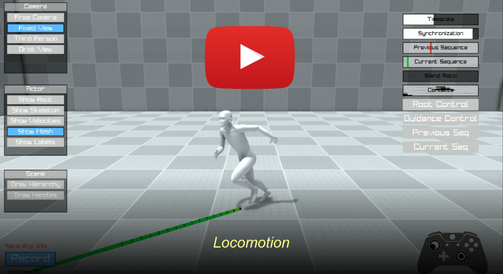
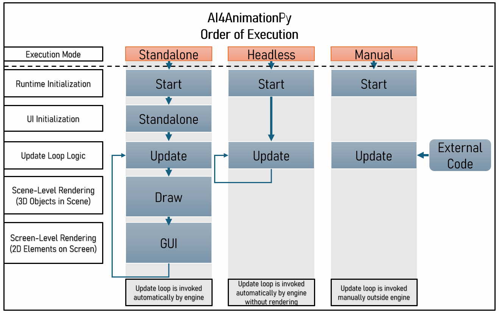
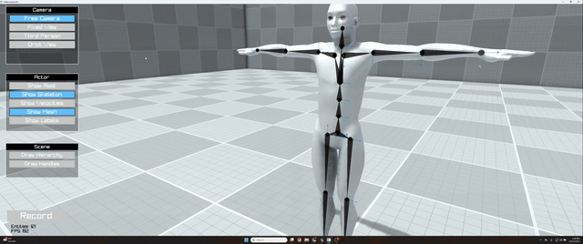
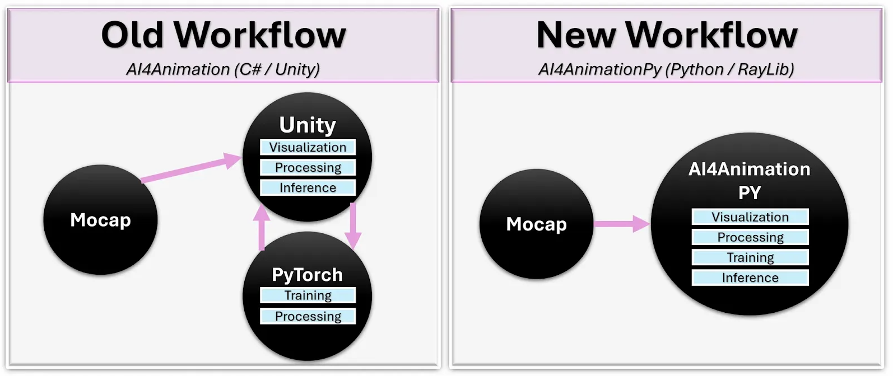

<div align="center">

# AI4AnimationPy

**A Python framework for AI-driven character animation using neural networks.**

Developed by [Paul Starke](https://github.com/paulstarke) and [Sebastian Starke](https://github.com/sebastianstarke)

[](LICENSE)
[](https://www.python.org/downloads/release/python-3120/)
[](https://facebookresearch.github.io/ai4animationpy/)

<a href="https://youtu.be/LKl7MzFENUs">

</a>

</div>

AI4AnimationPy enables character animation through neural networks and provides useful tools for motion capture processing, training & inference, and animation engineering. The framework brings [AI4Animation](https://github.com/sebastianstarke/AI4Animation) to Python — removing the Unity dependency for data-processing, feature-extraction, inference, and post-processing while keeping similar game-engine-style architecture (ECS, update loops, rendering pipeline). Everything runs on **NumPy** or **PyTorch**, so training, inference, and visualization happen in one unified environment.

## Getting Started

Please see the full documentation for installation instructions, and other practical tips for working with AI4AnimationPy:

[**Full Documentation**](https://facebookresearch.github.io/ai4animationpy/)

- [Installation Instructions](https://facebookresearch.github.io/ai4animationpy/getting-started/installation/)
- [Quick Start Guide](https://facebookresearch.github.io/ai4animationpy/getting-started/quickstart/)
- [Architecture Overview](https://facebookresearch.github.io/ai4animationpy/architecture/overview/)
- [Demo Programs](https://facebookresearch.github.io/ai4animationpy/tutorials/demos/)
- [API Reference](https://facebookresearch.github.io/ai4animationpy/api/actor/)

## Architecture
The framework can be executed via 1) using in-built rendering pipeline ("Standalone"), 2) headless mode ("Headless") or 3) manual execution ("Manual") which enables running code locally or remotely on server-side.
While both Standalone and Headless mode invoke automatic update callbacks, the Manual mode allows to manually control how often and at which time intervals the update loop is invoked.



## Interactive Demos
| | |
|---|---|
|  |  |
| **Stylized Locomotion Controller** trained on style100 | **Future Motion Anticipation** with Interactive model training visualization |
|  |  |
| **ECS** — Entity hierarchy and component system | **Inverse Kinematics** — Real-time IK solving |
|  |  |
| **Motion Capture Import** — GLB/FBX/BVH/NPZ loading | **Motion Editor** — animation browsing and feature visualization|

[View all demos  →](https://facebookresearch.github.io/ai4animationpy/tutorials/demos/)

## Why AI4AnimationPy?

Research on AI-driven character animation has required juggling multiple disconnected tools — model research happens in Python while visualization requires specialized software, and bridging the two involves custom communication pipelines. This creates friction that slows iteration and makes it difficult to validate results on-the-fly.

The training pipeline in [AI4Animation](https://github.com/sebastianstarke/AI4Animation) has been heavily dependent on Unity. While useful for visualization and runtime inference, communication with PyTorch had to go through ONNX or data streaming, creating a disconnect in the overall workflow. AI4AnimationPy solves this by fusing everything into one unified framework running only on NumPy/PyTorch:

- **Train neural networks** on motion capture data
- **Visualize instantly** without switching tools — training, inference, and rendering share the same backend
- **Run headless** for server-side training with optional standalone mode
- **Extend easily** with new features like geometry, audio, vision, or physics via the modular ECS design



| | AI4AnimationPy | AI4Animation (Unity) |
|---|---|---|
| **Training data generation** (20h mocap) | < 5 min | > 4 hours |
| **Setup time** for new experiment | ~10 min | > 4 hours |
| **Visualize**  inputs/outputs during training | Built-in | Requires streaming |
| **Backprop** through inference | ✅ Supported | ❌ Not possible |
| **Quantization** | Full PyTorch support | Limited to ONNX |
| **Visualization** | Optional built-in renderer | Built-in |

## Features

| | Feature | Status |
|---|---------|:------:|
| 🧩 | **Entity-Component-System** — modular architecture with lifecycle management | ✅ |
| 🔄 | **Update Loop** — game-engine-style callbacks (Update / Draw / GUI) | ✅ |
| 📐 | **Math Library** — vectorized FK, quaternions, axis-angle, matrices, mirroring | ✅ |
| 🧠 | **Neural Networks** — MLP, Autoencoder, Codebook Matching with training utilities | ✅ |
| 🖥️ | **Real-time Renderer** — deferred shading, shadow mapping, SSAO, bloom, FXAA | ✅ |
| 💀 | **Skinned Mesh Rendering** — GPU-accelerated skeletal mesh rendering | ✅ |
| 🦴 | **Inverse Kinematics** — FABRIK solver for real-time IK | ✅ |
| 🎬 | **Animation Modules** — joint contacts, root & joint trajectories | ✅ |
| 🎥 | **Camera System** — Free, Fixed, Third-person, Orbit mode with smooth blending | ✅ |
| 📦 | **Motion Import** — GLB, FBX, BVH | ✅ |
| ⚡ | **Execution Modes** — Standalone, Headless, Manual | ✅ |
| 🏗️ | Physics simulation (rigid bodies / collision) | 🔜 |
| 🛤️ | Path planning and spline tooling | 🔜 |
| 🔊 | Audio support | 🔜 |

## Motion Capture Import

The framework supports importing mesh, skin, and animation data from **GLB**, **FBX**, and **BVH** files. The internal motion format is `.npz`, storing 3D positions and 4D quaternions for each skeleton joint per frame.

```python
from ai4animation import Motion

motion = Motion.LoadFromGLB("character.glb")
motion = Motion.LoadFromFBX("character.fbx")
motion = Motion.LoadFromBVH("character.bvh", scale=0.01)
motion.SaveToNPZ("character")
```

Batch convert entire directories using the built-in CLI:

```bash
convert --input_dir path/to/motions --output_dir path/to/output
```

See the [Loading Motion Data](https://facebookresearch.github.io/ai4animationpy/getting-started/quickstart/#importing-motion-data) guide for setup details.

<summary><b>Public Datasets</b></summary>
Several public motion capture datasets are compatible with the framework:
<br>

| Dataset | Character | Download |
|---------|-----------|----------|
| [Cranberry](https://github.com/sebastianstarke/AI4Animation) | Cranberry | [FBX & GLB](https://starke-consult.de/AI4Animation/SIGGRAPH_2024/Cranberry_Dataset.zip) |
| [100Style retargeted](https://github.com/orangeduck/100style-retarget) | Geno | [BVH](https://theorangeduck.com/media/uploads/Geno/100style-retarget/bvh.zip) / [FBX](https://theorangeduck.com/media/uploads/Geno/100style-retarget/fbx.zip) |
| [LaFan](https://github.com/ubisoft/ubisoft-laforge-animation-dataset) | Ubisoft LaFan | [BVH](https://github.com/ubisoft/ubisoft-laforge-animation-dataset/blob/master/lafan1/lafan1.zip) |
| [LaFan resolved](https://github.com/orangeduck/lafan1-resolved) | Geno | [BVH](https://theorangeduck.com/media/uploads/Geno/lafan1-resolved/bvh.zip) / [FBX](https://theorangeduck.com/media/uploads/Geno/lafan1-resolved/fbx.zip) |
| [ZeroEggs retargeted](https://github.com/orangeduck/zeroeggs-retarget) | Geno | [BVH](https://theorangeduck.com/media/uploads/Geno/zeroeggs-retarget/bvh.zip) / [FBX](https://theorangeduck.com/media/uploads/Geno/zeroeggs-retarget/fbx.zip) |
| [Motorica retargeted](https://github.com/orangeduck/motorica-retarget) | Geno | [BVH](https://theorangeduck.com/media/uploads/Geno/motorica-retarget/bvh.zip) / [FBX](https://theorangeduck.com/media/uploads/Geno/motorica-retarget/fbx.zip) |
| [NSM](https://github.com/sebastianstarke/AI4Animation/tree/master/AI4Animation/SIGGRAPH_Asia_2019) | Anubis | [BVH](https://starke-consult.de/AI4Animation/SIGGRAPH_Asia_2019/MotionCapture.zip) |
| [MANN](https://github.com/sebastianstarke/AI4Animation/tree/master/AI4Animation/SIGGRAPH_2018) | Dog | [BVH](https://starke-consult.de/AI4Animation/SIGGRAPH_2018/MotionCapture.zip) |


## License

AI4AnimationPy is licensed under the [CC BY-NC 4.0 License](LICENSE).
